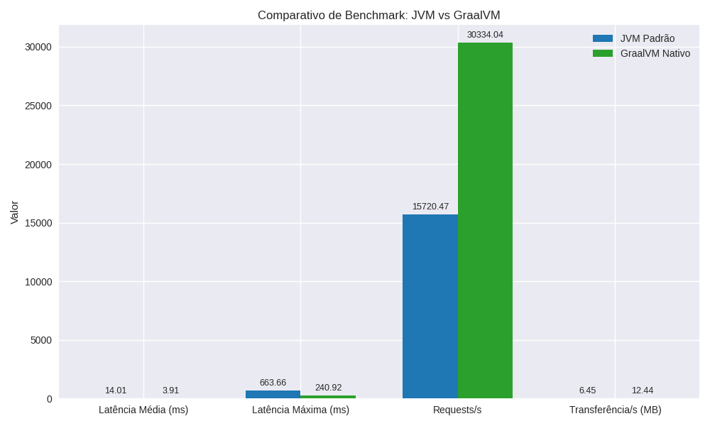

## 🧪 Laboratório de Benchmarks

### 🎯 Objetivo
Avaliar a performance de uma aplicação **Spring Boot** rodando em:
- ☕ JVM padrão (OpenJDK 21)
- ⚡ Binário nativo compilado com **GraalVM Native Image**

### 🖥️ Ambiente de Testes
- **SO:** Ubuntu 22.04 (Linux 6.8.0-90-generic amd64)
- **Java:**
    - JVM: OpenJDK 21
    - Nativo: GraalVM 21.0.1 com suporte a `native-image`
- **Ferramenta de benchmark:** [`wrk`](https://github.com/wg/wrk)
- **Configuração de carga:** 4 threads · 100 conexões · 30 segundos
- **Endpoint testado:** `http://localhost:8080/catalog`

### 🔬 Procedimento
1. Subir a aplicação em JVM:
   ```bash
   ./gradlew bootRun
   wrk -t4 -c100 -d30s http://localhost:8080/catalog

## Benchmark: JVM vs GraalVM



### Resultados
- **JVM padrão**: ~15k req/s, latência média 14ms
- **GraalVM nativo**: ~30k req/s, latência média 3.9ms

